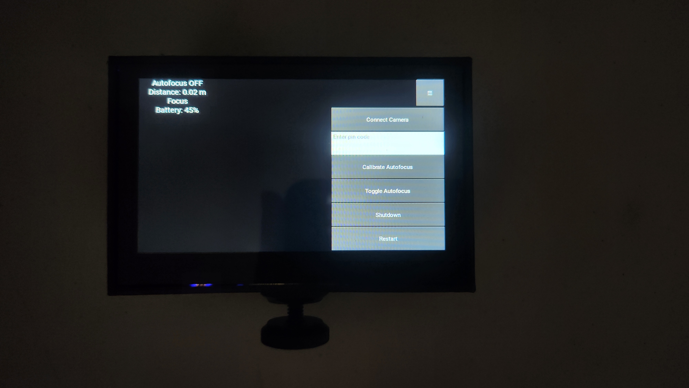
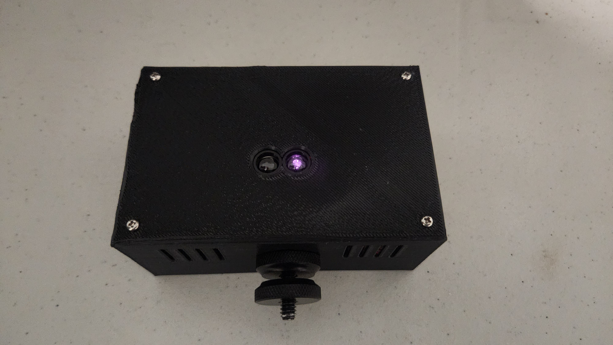

# Blackmagic Lidar Autofocus system

Welcome to the Project! Documentation is currently in development.

## Current config

Tested & made for:
- Raspberry Pi 4/5
- Benewake TF-Luna Lidar
- Pisugar 3 Plus Battery

## My current setup

3D printed protype case was made for this project.

*Front*

*Back*

# Libraries Used

- Kivy
- Numpy
- CV2
- D-Bus & BlueZ

## Contributing

Feel free to fork and improve on this project.

## License

This project is licensed under the [MIT License](LICENSE).
